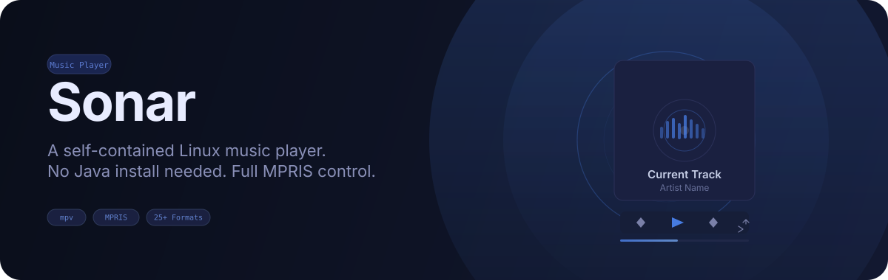
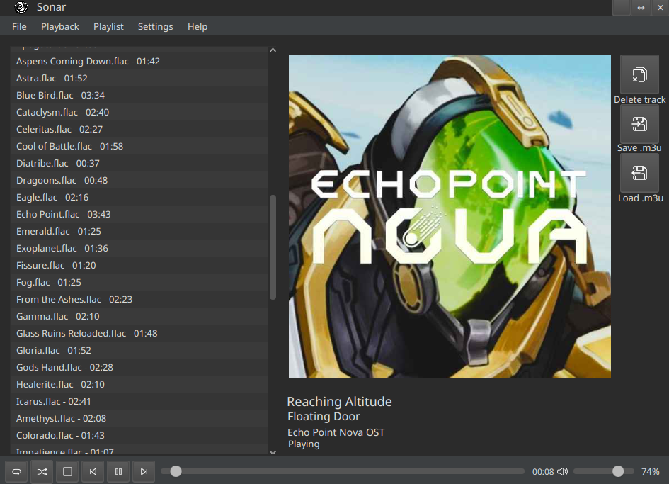
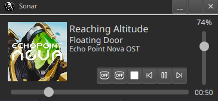
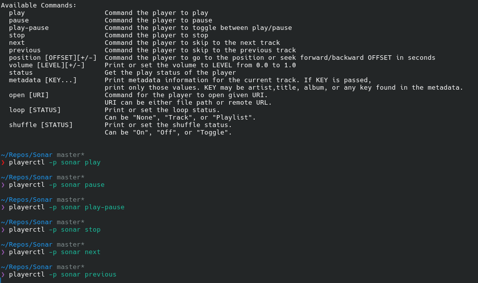

<p align="center">
  
</p>

Sonar is a desktop music player for Linux and Windows. It bundles its own Java runtime, so you don't need a JRE installed, and it plays 27 audio formats through libmpv. On Linux it implements MPRIS v2, so your desktop environment, `playerctl`, and KDE Connect can control playback natively.

| | Linux | Windows |
|---|---|---|
| Playback (libmpv) | ✅ system `libmpv` | ✅ bundled `libmpv-2.dll` |
| Bundled Java runtime | ✅ | ✅ |
| MPRIS / media keys / KDE Connect | ✅ | ❌ D-Bus is Linux-only |
| Album art and playlist durations | ✅ system `ffmpeg` | ✅ bundled `ffmpeg` |
| Code-signed binary | n/a | ✅ Authenticode |

---

<p align="center">
  
</p>

<table>
<tr>
<td align="center" width="50%">
  <p><strong>Main window</strong></p>
  
</td>
<td align="center" width="50%">
  <p><strong>Mini player</strong></p>
  
</td>
</tr>
</table>

<p align="center">
  <strong>MPRIS control</strong><br>
  
</p>

---

## Design notes

Most Java media players use JavaFX MediaPlayer, which sits on GStreamer and registers as "GStreamer" in the system mixer. Sonar calls libmpv directly through JNA instead, so the audio pipeline runs inside the JVM and shows up as "Sonar" in your mixer and volume controls.

The MPRIS D-Bus service runs in a separate C daemon rather than inside the JVM. GStreamer on Linux is known to close arbitrary file descriptors, including the D-Bus socket, which breaks in-process D-Bus libraries. Keeping the connection in its own process avoids that class of problem regardless of what native code the JVM loads.

| Approach | Audio backend | Mixer label | MPRIS |
|----------|--------------|-------------|-------|
| JavaFX MediaPlayer (typical) | GStreamer | GStreamer | In-process, D-Bus socket can be closed |
| Sonar | libmpv (JNA) | Sonar | Out-of-process C daemon, isolated from JVM file descriptors |

---

## Features

- **Bundled runtime.** `jlink` ships a minimal JDK 21 runtime, so no Java installation is required.
- **27 audio formats.** MP3, FLAC, Ogg, Opus, AAC, WAV, WMA, APE, ALAC, MIDI, tracker modules, and more.
- **MPRIS v2** (Linux). Control playback from GNOME Shell, KDE Connect, `playerctl`, or any MPRIS client. Media keys work on desktops that route them through MPRIS.
- **Album art.** Extracts embedded cover art with ffmpeg, falling back to a placeholder when none is found.
- **Playlist management.** Drag-and-drop, folder scanning, extended M3U save and load.
- **Shuffle modes.** Shuffle all, or shuffle-next to pick one random track without reordering the playlist.
- **Repeat modes.** Off, repeat all, repeat one.
- **Mini player.** Shrink to a compact floating window.
- **Dark and light themes.** Toggled from the menu bar.
- **Custom window chrome.** Undecorated window with an integrated drag region and minimize/close controls.
- **Settings persistence.** Volume and theme are saved to `~/.config/sonar/settings.properties`.

---

## Install

Grab the latest build from the [releases page](../../releases).

### Linux

```bash
tar xzf sonar-1.0-linux.tar.gz
cd sonar-1.0
sudo ./install.sh
sonar
```

This installs system-wide to `/opt/sonar` and needs root. For a build from source you can install without root instead; see below.

The package bundles a Java runtime but links against two system libraries:

- **`libmpv`** (required). Sonar loads it at runtime and will not play audio without it. Install `mpv` or `libmpv` from your distribution's repositories.
- **`ffmpeg`** (optional). Used only to extract embedded album art. Without it, tracks show the placeholder cover.

### Windows

Unzip `sonar-1.0-windows-x64.zip` anywhere and run `Sonar.exe`. There is no installer, nothing is written to the registry, and nothing lands outside the folder except the settings file.

Windows has no system libmpv and no system ffmpeg, so unlike the Linux package this one bundles both: `app\libmpv-2.dll` and `app\ffmpeg\`. Nothing else needs installing.

The one functional difference from Linux is that **there is no MPRIS**. MPRIS is a freedesktop.org D-Bus specification, so desktop media-key bindings and KDE Connect integration don't exist on Windows. Playback is unaffected.

### Building from source

Build prerequisites:

- JDK 21+ (a full JDK: `jlink` and, on Windows, `jpackage` are required). Sources target Java 21 via `maven.compiler.release`, but releases are built with JDK 25 LTS, since that is the JDK that gets linked into the shipped runtime.
- Maven, handled by the bundled `mvnw` wrapper
- Linux only: `gcc` and `libdbus-1-dev`, for the MPRIS C daemon
- Windows only: 7-Zip on `PATH`, to unpack the libmpv and ffmpeg downloads

Neither platform needs libmpv installed at build time. Sonar binds to it through JNA at runtime, so there are no headers to include and nothing to link against.

> **`.mvn/jvm.config` must stay portable across JDKs.** Every token in that file is passed verbatim to the Maven JVM (it does not support comments), and an option the running JDK doesn't recognize aborts the JVM before Maven starts. So it may only contain flags valid on every JDK used to build the project, currently 21 through 26. Version-specific flags belong in `MAVEN_OPTS` on the machine that needs them. For example, JDK 26 warns that Maven's own Sisu/Plexus internals mutate a final field reflectively; to silence that locally without breaking CI:
>
> ```bash
> export MAVEN_OPTS="--enable-final-field-mutation=ALL-UNNAMED"
> ```

**Per-user install (no root).** `update.sh` builds the package and installs it under `$HOME` using XDG locations:

```bash
git clone https://github.com/bohdan-myronenko/Sonar.git
cd Sonar
./update.sh
```

It refuses to run as root, so the build artifacts in `target/` stay owned by you. Files land in:

| Path | Contents |
|------|----------|
| `~/.local/share/sonar/` | Runtime, launcher, license notices |
| `~/.local/bin/sonar` | Symlink to the launcher |
| `~/.local/share/applications/` | Desktop entry |
| `~/.local/share/icons/hicolor/` | Icon |
| `~/.local/share/dbus-1/services/` | MPRIS service file |

Re-run `./update.sh` to rebuild and reinstall over a previous per-user install. If `~/.local/bin` is not on your `PATH`, the script says so.

**System-wide install.** Build the tarball and use the generated installer:

```bash
git clone https://github.com/bohdan-myronenko/Sonar.git
cd Sonar
./package.sh
cd target/package/sonar-1.0
sudo ./install.sh
```

Don't run `./package.sh` itself under `sudo`. Only `install.sh` needs root, and building as root leaves `target/` owned by `root`, which breaks later builds.

Set `VERSION` to stamp a different version onto the artifact: `VERSION=1.1 ./package.sh`.

**Windows.** From a PowerShell prompt in the project root:

```powershell
.\package.ps1 -Version 1.0
```

This produces `target\sonar-1.0-windows-x64.zip`. The script downloads pinned, SHA-256-verified LGPL builds of [libmpv](https://github.com/zhongfly/mpv-winbuild/releases) and [ffmpeg](https://github.com/BtbN/FFmpeg-Builds/releases), bundles them, then wraps the `jlink` runtime with `jpackage` to produce `Sonar.exe`. The build fails loudly if either checksum doesn't match.

To move to newer dependencies, update the `Mpv*` or `Ffmpeg*` defaults at the top of the script as a set. Two things to know when re-pinning ffmpeg: BtbN prunes daily `autobuild-*` releases after roughly two weeks but keeps the month-end ones indefinitely, so **pin to a month-end tag** or the URL will 404 within a fortnight; and the LGPL *shared* asset is chosen over the static one because static `ffmpeg.exe` and `ffprobe.exe` are about 75 MB each.

### Releases

`.github/workflows/release.yml` builds both platforms on tag pushes matching `v*` and opens a draft GitHub release with both artifacts and a `SHA256SUMS` file. `jlink` and `jpackage` cannot cross-compile, so each platform is built on its own runner. The Linux job pins `ubuntu-22.04` deliberately: the runtime image and the MPRIS daemon link against the runner's glibc, so that choice sets the oldest distro the release supports.

Run the workflow manually (`workflow_dispatch`) to build both platforms and upload artifacts without creating a tag or release.

Signing is optional and driven by repository secrets. When they are absent the build still succeeds and simply produces unsigned output, so forks and pull requests work unchanged.

| Secret | Effect |
|---|---|
| `WINDOWS_SIGNING_PFX_BASE64` | Base64 of an Authenticode `.pfx`. Signs `Sonar.exe` with an RFC 3161 timestamp. |
| `WINDOWS_SIGNING_PFX_PASSWORD` | Password for that `.pfx`. |
| `GPG_PRIVATE_KEY` | ASCII-armored private key. Produces `SHA256SUMS.asc`. |
| `GPG_PASSPHRASE` | Passphrase for that key. |

Since June 2023 no public CA issues downloadable `.pfx` files for OV code signing; keys must live on hardware or in a cloud HSM. To exercise the signing path without a real certificate, generate a throwaway self-signed one (it will not satisfy SmartScreen):

```bash
openssl req -x509 -newkey rsa:3072 -noenc -keyout k.pem -out c.pem -days 1095 \
  -subj "/CN=Sonar Test Signing" \
  -addext "basicConstraints=critical,CA:FALSE" \
  -addext "keyUsage=critical,digitalSignature" \
  -addext "extendedKeyUsage=critical,codeSigning"

# -keypbe/-certpbe/-macalg force the legacy PKCS#12 algorithms; OpenSSL 3
# defaults to AES-256/PBKDF2, which Windows CryptoAPI can refuse to import.
openssl pkcs12 -export -out sonar-signing.pfx -inkey k.pem -in c.pem \
  -name "Sonar Test Signing" -passout pass:CHANGEME \
  -keypbe PBE-SHA1-3DES -certpbe PBE-SHA1-3DES -macalg sha1

base64 -w0 sonar-signing.pfx    # paste into WINDOWS_SIGNING_PFX_BASE64
rm k.pem c.pem                  # never commit these
```

Chain validation is intentionally non-fatal in `package.ps1`, so a self-signed certificate signs successfully and the build reports the resulting signature status rather than failing.

Verifying a Linux release:

```bash
gpg --verify SHA256SUMS.asc SHA256SUMS
sha256sum --check --ignore-missing SHA256SUMS
```

---

## Usage

```bash
sonar
```

### MPRIS control

Once Sonar is running, any MPRIS client can control it:

```bash
playerctl -p sonar play-pause
playerctl -p sonar next
playerctl -p sonar previous
playerctl -p sonar volume 0.8
playerctl -p sonar metadata
```

KDE Connect, GNOME Shell's media widget, and status-bar player applets discover Sonar automatically.

---

## Architecture

```
┌──────────────────────────────────────┐
│            JavaFX UI                 │
│  SonarController ── MiniController   │
└──────────────┬───────────────────────┘
               │
┌──────────────▼───────────────────────┐
│         Player (libmpv via JNA)      │
│  audio decode  →  system mixer       │
│  event loop    →  property observe   │
└──────────────┬───────────────────────┘
               │           IPC (Unix socket)
┌──────────────▼───────────────────────────────────┐
│            MprisService (Java)                   │
│  sends state     │     receives D-Bus calls      │
└──────┬───────────┴──────────────┬────────────────┘
       │                          │
┌──────▼──────────────────────────▼────────────────┐
│        sonar_mpris_d (C daemon)                  │
│  D-Bus session bus   ←→   org.mpris.MediaPlayer2 │
└──────────────────────────────────────────────────┘
```

The C daemon holds the D-Bus connection in a process separate from the JVM. The Java side sends playback state over a Unix-domain socket, and the daemon translates incoming D-Bus method calls (Play, Pause, Seek, and so on) back over the same channel. This keeps the D-Bus connection isolated from any file-descriptor handling inside the JVM.

---

## Supported formats

`.mp3` `.wav` `.aac` `.m4a` `.flac` `.ogg` `.opus` `.aiff` `.aif` `.wma` `.wavpack` `.wv` `.ape` `.mka` `.ac3` `.dts` `.alac` `.tta` `.spx` `.ra` `.rm` `.mid` `.midi` `.mod` `.xm` `.s3m` `.it`

---

## Uninstall

On Windows, delete the unzipped folder. Sonar writes nothing outside it except its settings file.

On Linux, for a per-user install, from the project root:

```bash
./update.sh --uninstall
```

For a system-wide install:

```bash
sudo /opt/sonar/uninstall.sh
```

Or manually:

```bash
sudo rm -rf /opt/sonar
sudo rm -f /usr/local/bin/sonar
sudo rm -f /usr/share/applications/sonar.desktop
sudo rm -f /usr/share/icons/hicolor/256x256/apps/sonar.png
sudo rm -f /usr/share/dbus-1/services/org.mpris.MediaPlayer2.sonar.service
```

If both are installed, whichever of `~/.local/bin` and `/usr/local/bin` comes first on your `PATH` wins.

---

## Tech stack

| Layer | Technology |
|-------|-----------|
| UI | JavaFX 27 (FXML) |
| Language | Java 21 |
| Audio | libmpv via JNA |
| Desktop integration | MPRIS v2 D-Bus spec |
| IPC | Unix-domain sockets |
| Packaging | `jlink` plus a shell launcher (Linux), `jlink` + `jpackage` (Windows) |
| Build | Maven, GitHub Actions |

---

## License

Sonar is licensed under the [BSD 3-Clause License](LICENSE).

`src/main/resources/folltrace/sonar/player.fxml` derives from the [Gluon Scene Builder samples](https://gluonhq.com/products/scene-builder/) and retains its original BSD 3-Clause notice from Oracle and Gluon.

Third-party components in the distributed package:

| Component | License | Distribution |
|-----------|---------|--------------|
| OpenJDK runtime (`jlink`) | GPLv2 with Classpath Exception | Bundled |
| OpenJFX | GPLv2 with Classpath Exception | Bundled |
| JNA | Apache-2.0 or LGPL-2.1+ | Bundled |
| libmpv | LGPL-2.1+ | System library on Linux; bundled on Windows |
| ffmpeg / ffprobe | LGPL-2.1+ | System tools on Linux; bundled on Windows |
| libdbus | AFL-2.1 or GPL-2.0+ | System library (Linux only), not bundled |

The Windows package redistributes libmpv and ffmpeg, so it ships the LGPL-2.1 text along with the exact upstream build URL, checksum and source revision for each, under `licenses\mpv\` and `licenses\ffmpeg\`. **LGPL** builds are used on purpose for both: the widely mirrored Windows builds of each are GPL, which would force the entire distribution under GPL terms. libmpv is loaded dynamically through JNA and ffmpeg is invoked as a separate process, so neither is linked into Sonar and you can replace either with your own build.
